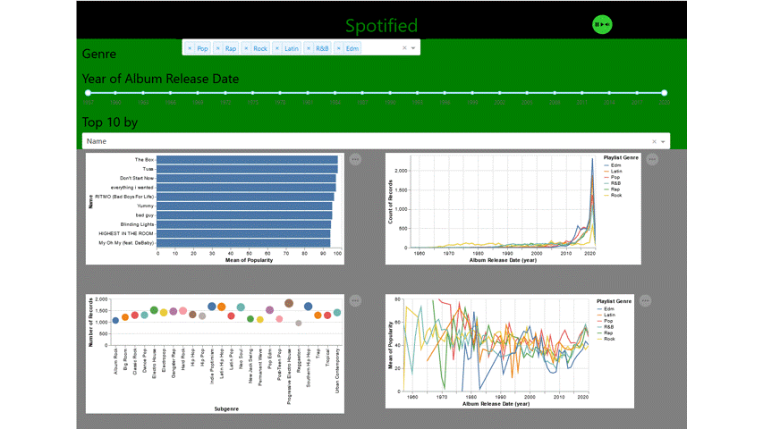

# Spotified (Group G)

[Public repository used for deployment]('https://github.com/SaraAnnHall/prototype_deployment')

[Link to the deployed app](https://prototype-deployment-test.herokuapp.com/)

## Goals

- To determine which songs and artists have been the most popular over time. 
- To determine how both the popularity and number of records released within each genre have changed over time. 
- To see the breakdown of each genre into its subgenres. 

## Team Members

- Mayukha Bheemavarapu : I love music
- Neethu Gopalakrishna : I love to read
- Sara Hall : I like to bike and run
- Xin Tian : I love sports

## Describe your topic/interest in about 150-200 words

We are all music enthusiasts and we have always been curious as to how music has evolved over time, particulary with which genres, songs and artists have been the most popular throughout recent history. 

Spotify is a very large music platform with subscribers from all around the world. If we can understand when different genres have become popular in the past, we might be able to predict future trends. With this goal in mind, we will build an interactive visualization dashboard that will show the top 10 songs or artists within the genres and timeframe selected my the user. We will also show how the number of songs released and popularity within each genre has changed, and how each genre has been divided into subgenres.

## About this Dashboard

The app opens initially to show the top 10 songs in the whole dataset, both the number of tracks released and mean popularity per year for each of the genres, and the breakdown of the number of tracks into subgenres. This is done by arranging the plots in a grid. In the top left, the top 10 songs or artists are displayed. In the top right, the number of songs released in each genre per year is shown. In the bottom left, the breakdown of all selected genres into subgenres by number of released songs can be seen. Finally, in the bottomw right, the mean popularity of songs in each genre per year is plotted. All four of these plots are updated by changing which genres are selected in the dropdown menu and by changing the year range in the slider bar. To switch between showing the top 10 artists and top 10 songs for the selected year range and genres, the bottom drop down menu can be used. 

If time permits, we will also include two modelling tabs, one for predicting song genre, and one for predicting song popularity. 

## Describe your dataset in about 150-200 words

This [dataset](https://github.com/rfordatascience/tidytuesday/tree/master/data/2020/2020-01-21) was provided on Github as the January 21, 2020 [Tidy Tuesday challenge](https://|github.com/rfordatascience/tidytuesday). As a result, this datset was provided with the purpose of learning how to wrangle and visualize data in R, and we are using it in a similar context to practice exploratory data analysis in Python. The data in the `csv` file were collected in January 2020 using the [`spotifyr`](https://www.rcharlie.com/spotifyr/) R package, which connects to the [Spotify Web API](https://developer.spotify.com/documentation/web-api/). The dataset contains information about around 30000 songs available on Spotify. This includes several variables identifying the song (id, name, artist, release date, album id, and album name), along with information about the playlist on which it was found (name, id, genre, and subgenre). Finally, it includes several numerical variables about the songs that we are mainly interested in analyzing (popularity, danceability, energy, key, loudness, mode, speechiness, acousticness, instrumentalness, liveness, valence, tempo, and duration). 

## Developers' Notes

If you are interested in contributing to our application, please let us know through emails. We would like some expert's opinions on the funcationality and UI of the dashboard. Here is a demo on how to run our application locally:

1. Clone the project from Github.
2. Install dependencies on your local computer for this project.
3. Open a terminal in the project, run `python Plot1_app.py`, then navigate to localhost:8050 in your web browser to see the running application.
