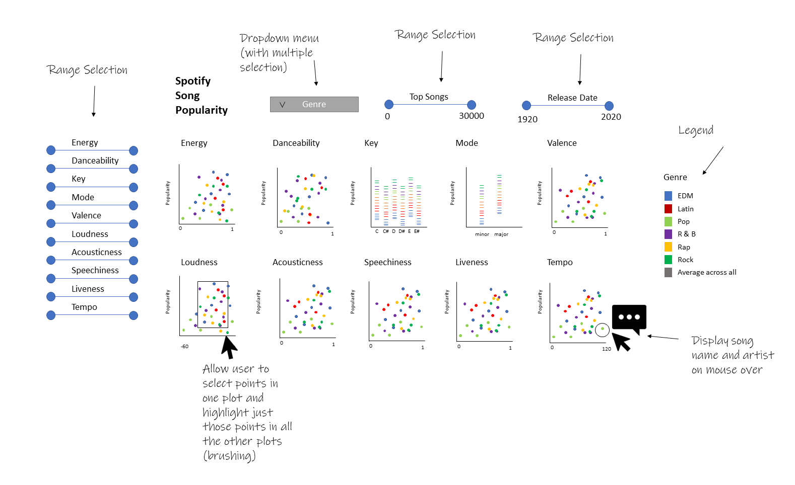

# Spotified (Group G)

[Public repository used for deployment](https://github.com/MayukhaB/prototype_development_spotified)

[Link to the deployed app](https://prototype-for-spotified.herokuapp.com/)

## Goals

- To determine what makes a song popular based on the attributes present in the data, track_popularity, danceability, energy, key, loudness, mode, speechiness, acousticness, instrumentalness, etc.
- While the correlations between individual metrics and song popularity are quite small, how much of the variation in song popularity can be explained by these metrics if we use all of them as predictors in a linear regression?

## Team Members

- Mayukha Bheemavarapu : I love music
- Neethu Gopalakrishna : I love to read
- Sara Hall : I like to bike and run
- Xin Tian : I love sports

## Describe your topic/interest in about 150-200 words

We are all music enthusiasts and we have always been curious as to how a spotify algorithm works especially, what makes a song pop up on the 'most popular' list? What attributes of a song make it popular?

Spotify is a very large music platform with subscribers from all around the world. If we can understand what song qualities are associated with popularity in different genres, then this will provide valuable information to music creators. Furthermore, it may provide insights into the Spotify algorithm and how songs are ranked in terms of popularity. With this goal in mind, we will build an interactive visualization dashboard that will show how different song characteristics like energy and acousticness are related to song popularity within diffenent music genres. By using user interactions like filtering by genre, artist, or top ranking songs, we hope to elucidate some of these relationship between different song qualities.

## About this Dashboard

The app will open initially to show how all the different song metrics are related to popularity. This will be done by arranging the plots in a grid, with energy, danceability, key, mode, valence, loudness, acousticness, speechiness, liveness, and tempo on the x-axes and popularity on the y-axes. All of these except for key and mode are numerical, so they will be plotted as scatter plots, while key and mode are categorical and will be plotted as rug plots to show the distributions. Colour coding will be used to differentiate between genres, and on mouseover, a tooltip will be employed to display the song and artist names for each data point. Because there are a lot of data points, we also plan to use extensive filtering. This will also enable music creators to adjust the levels of different metrics to see the popularity associated with songs like what they want to create. They will be able to select one or more genres to display, how many songs they want (e.g., top 10, bottom 10, middle 50, etc.), release date range, and levels of key metrics (energy, danceability, key, mode, valence, loudness, acousticness, speechiness, liveness, and tempo). Finally, if we have sufficient time, we will also implement brushing so that if points are selected in one plot, they will be highlighted in all the others. 

If time permits, we will also include two modelling tabs, one for predicting song genre, and one for predicting song popularity. 

## Describe your dataset in about 150-200 words

This [dataset](https://github.com/rfordatascience/tidytuesday/tree/master/data/2020/2020-01-21) was provided on Github as the January 21, 2020 [Tidy Tuesday challenge](https://|github.com/rfordatascience/tidytuesday). As a result, this datset was provided with the purpose of learning how to wrangle and visualize data in R, and we are using it in a similar context to practice exploratory data analysis in Python. The data in the `csv` file were collected in January 2020 using the [`spotifyr`](https://www.rcharlie.com/spotifyr/) R package, which connects to the [Spotify Web API](https://developer.spotify.com/documentation/web-api/). The dataset contains information about around 30000 songs available on Spotify. This includes several variables identifying the song (id, name, artist, release date, album id, and album name), along with information about the playlist on which it was found (name, id, genre, and subgenre). Finally, it includes several numerical variables about the songs that we are mainly interested in analyzing (popularity, danceability, energy, key, loudness, mode, speechiness, acousticness, instrumentalness, liveness, valence, tempo, and duration). 

